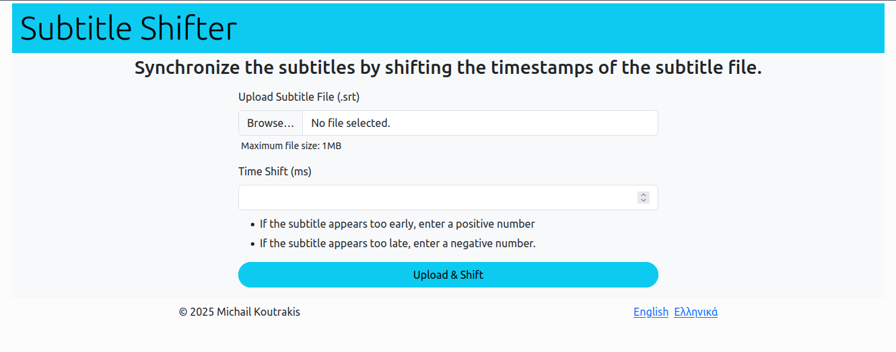

# Subtitle Shifter

Easily adjust subtitle timings by uploading your `.srt` file, specifying the time shift, and synchronizing your subtitles.

## Prerequisites
- **Java 17+**

## How to Run the App

1. Clone the repository.
2. Open a terminal inside the cloned repository and run the following commands based on your operating system:

    ### Linux/MacOS
    ```bash
    ./gradlew bootRun
    ```
    
    ### Windows
    ```console
    gradlew.bat bootRun 
    ```

3. Open your favorite browser and visit `http://localhost:8080`. You should see the interface as shown in the screenshot below.

## Screenshot

